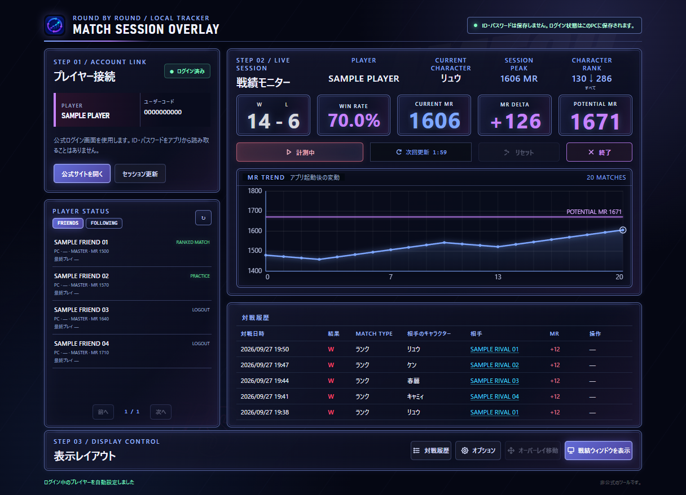
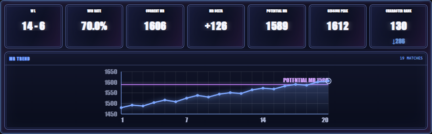
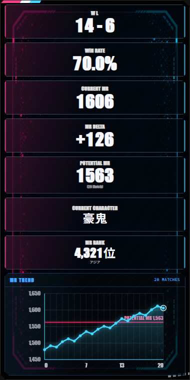
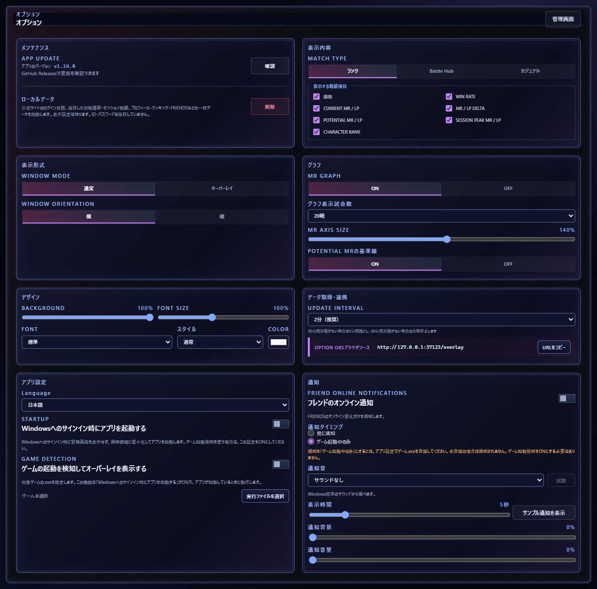
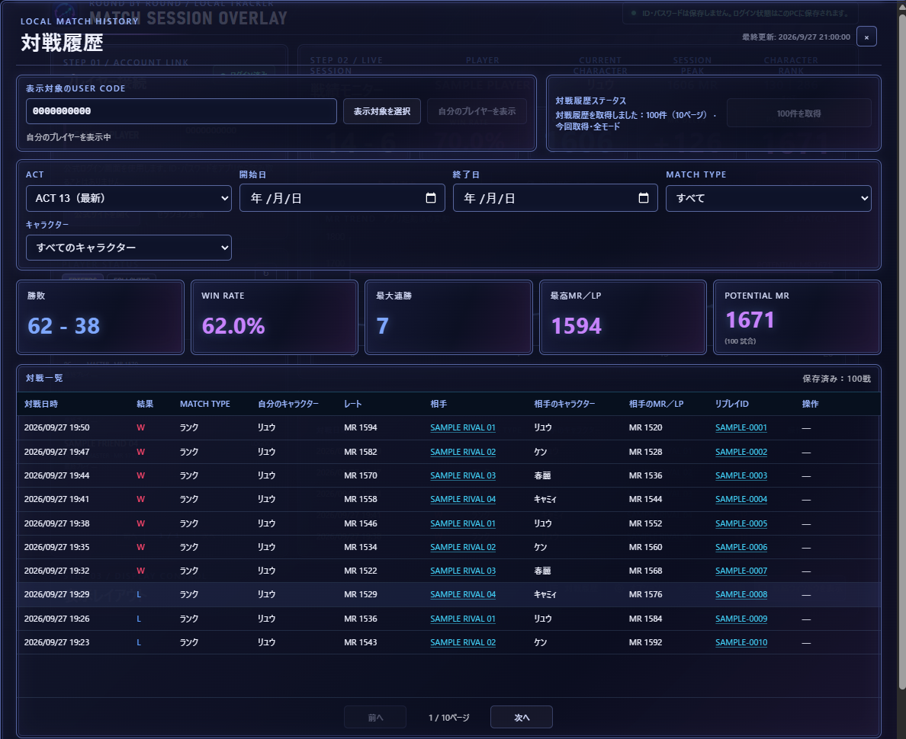
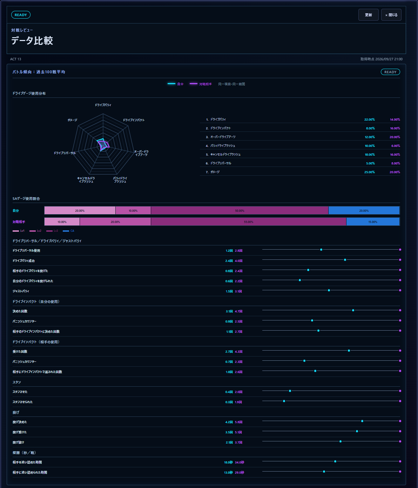
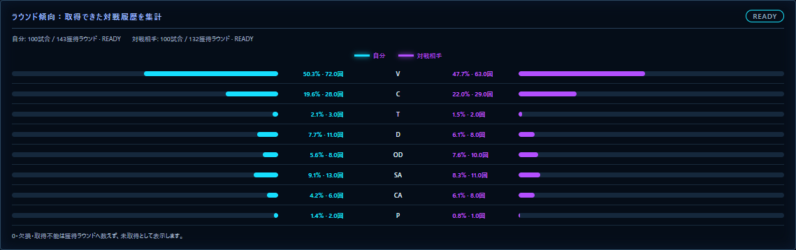

# Match Session Overlay

[日本語](README.md) | English

Match Session Overlay is an unofficial Windows app that retrieves Street Fighter 6 match data and displays your session wins and losses, win rate, MR/LP, rating change, current character, character ranking, and match history. You can use it as a regular window, an in-game overlay, or an OBS browser source.

> [!IMPORTANT]
> This is an unofficial tool. Changes to the official website may prevent match data from being retrieved without notice.

## Requirements

- Windows 10 or later (64-bit)
- An internet connection for signing in to the official website and retrieving match data
- OBS Studio only if you want to display the overlay on stream (optional)

Public release: v1.14.1

## Download

[Get the official build from GitHub Releases](https://github.com/mickangumi-oss/match-session-overlay/releases).

Open the release and download `Match-Session-Overlay-1.14.1-Setup.exe` from **Assets**. Do not use an installer from an unverified source.

For step-by-step instructions, see the [English usage guide](docs/usage.en.md).

### Distribution checksums and security checks

Get the installer from this repository's official GitHub Release. The [v1.14.1 release notes](docs/release-notes/v1.14.1.md) include its SHA-256 and the security-check results recorded at publication. Those results do not guarantee complete safety.

## Screenshots

The management, options, and match-history screenshots show the public v1.14.0 interface with synthetic test data. All names, user codes, dates, match records, and replay IDs are fictional samples; no real user data is used. The horizontal and vertical layouts also use synthetic sample data. Visible fields, fonts, colors, and sizes depend on your settings.

### Management screen

### Horizontal stats window

### Vertical overlay

### Options

### Match history

Filter by ACT, date range, match mode, and your character to view summary statistics, the match list, a win/loss graph, and results by opponent character. This screenshot shows the ACT, filters, summary, and list using 100 synthetic matches.

### Data comparison

Select a match-history row and open **Data comparison** in the opponent information panel to compare your tendencies with the opponent's. These screenshots use synthetic test data.

Battle trends compare metrics such as Drive and SA gauge-use breakdowns, average parry and throw counts, and average time near the corner.

Round trends compare rounds won and finish types from the acquired history. Each player's match count and rounds won are shown; unavailable values are not treated as zero.

## What's new in v1.14.1

- Fixed `POTENTIAL MR` showing a value far from reality when every counted match was a win or every counted match was a loss. It now shows the highest opponent MR (the lowest for all losses).
- When the selected match is older than your latest 100 official matches, the app now shows that it is outside the official range (latest 100 matches) instead of a retrieval failure.

## What's new in v1.14.0

- Friend online notifications now follow the selected display language.
- Match history now shows separate counts for matches in the last 7 play days and saved matches, plus the official opponent statistics match count.
- The match history screen now makes clear that imports cover all match modes.
- When a selected match is outside the official site's latest 100 entries, the screen shows that reason.
- A dedicated progress bar appears while the selected match's opponent profile loads.
- The match history import button shows a gauge for the wait until the next import is available.
- Opponent profiles load faster.
- When new matches are added to match history, the official statistics by opponent character update automatically.
- In the selected match's opponent profile, unavailable values appear as “—” with the reason shown in the heading.
- Fixed an issue where an older response could show information for a different history target while switching targets.

See the [v1.14.0 release notes](docs/release-notes/v1.14.0.md) for distribution details.

## What's new in v1.13.0

- `POTENTIAL MR` now uses opponent MR and match results from up to 100 recent same-character Ranked Matches.
- Match history, graphs, and opponent information use the same `POTENTIAL MR` method.
- Opponent profile display (up to 20 matches) is separate from `POTENTIAL MR` calculation history (up to 100 matches).
- `POTENTIAL LP` retains the previous method.

See the [v1.13.0 release notes](docs/release-notes/v1.13.0.md) for the details.

## What's new in v1.12.1

- ACT selection and match-history display now use the ACT information retrieved from the official site as their reference.
- ACT-specific history, aggregates, opponent information, and caches remain separated when you switch ACTs.
- The selected match's round results are displayed in match history.
- You can compare your battle and round trends with the selected opponent.
- Saved history is displayed first, and duplicate requests are reduced when loading the same history scope.

See the [v1.12.1 release notes](docs/release-notes/v1.12.1.md) for the installer checksum and release details.

## What's new in v1.12.0

- You can select an ACT in match history and review its history, aggregates, and opponent information.
- The selected match's round results are now displayed.
- You can compare your battle and round trends with the selected opponent.
- Saved history is displayed first, and duplicate requests are reduced while loading history.

See the [v1.12.0 release notes](docs/release-notes/v1.12.0.md) for the earlier release details.

## What's new in v1.11.0

- Selecting a match now shows up to 20 of the opponent's most recent matches before that match, using the character from the selected match.
- The opponent's character-specific POTENTIAL MR and LP are calculated separately, and insufficient history is shown as `—`.
- Opponent details for the selected match are saved so the same information is shown when you reopen it.
- The opponent profile card information was streamlined.
- Long numbers in the opponent detail card shrink automatically to fit the card width.

See the [v1.11.0 release notes](docs/release-notes/v1.11.0.md) for the details.

## What it can show

- Ranked, Battle Hub, and Casual session records
- Wins, losses, win rate, current MR/LP, and the change since tracking began
- `CHARACTER RANK` for the current character
- `POTENTIAL MR` from up to 100 recent same-character ranked matches and `POTENTIAL LP` from up to 20 recent matches, calculated separately
- Match history filtered by ACT, date, mode, and character
- MR/LP trends and records by opponent character; a win/loss graph for the last 7 play days in the filtered results, with separate counts for the graph and saved matches
- FRIENDS and FOLLOWING lists, with an optional notification when a friend comes online
- Japanese, English, and 12 other display languages

`POTENTIAL MR` is estimated from opponent MR and win/loss results using an Elo-style expected-win model over up to 100 recent same-character ranked matches. `POTENTIAL LP` uses robust exponential smoothing over up to 20 recent matches. Each value requires at least two valid samples. Both are app-specific reference values, not official ratings or predictions of a future rating.

## Display options

- A regular horizontal or vertical window
- An in-game overlay with adjustable position and click-through locking
- An OBS browser source at `http://127.0.0.1:37123/overlay`

Display fields, orientation, background transparency, font, size, style, and colors can be configured in the app.

## Getting started

1. Download the latest installer from the official GitHub Releases page.
2. Install and start the app.
3. In **Player Connection**, open the official website and sign in there.
4. Choose a match mode and select **Start Tracking**.
5. Open a stats window, configure the in-game overlay, or add the OBS browser source.

See the [English usage guide](docs/usage.en.md) for details and troubleshooting.

## Match history and opponent information

Open **Match History** to view saved matches. **Import 100 matches** retrieves up to 100 of the official site's latest entries across all match modes (10 per page, up to 10 pages). This is a cap: an import can finish with fewer than 100 matches. Manual imports for the same USER CODE are limited to once every 10 minutes. The screen shows the fetched page and match counts and import progress.

Filter history by ACT, date range, match mode, and your character. ACT options come from information retrieved from the official site. When the ACT or its range cannot be verified, the app shows an unverified state rather than guessing an ACT from a date.

Select a match row to open **Opponent Profile Reference**. It shows the opponent's character and MR/LP at that match, up to 20 earlier matches with that character, and POTENTIAL MR/LP. The POTENTIAL MR calculation uses up to 100 matches, separately from the 20-match display. Unavailable values appear as “—” with a reason. An older selected match may be outside the official site's latest 100 entries.

The opponent-information screen also shows the selected match's round results. **Data Comparison** lets you review your battle and round trends alongside the opponent's. Missing data can make a section partial or unavailable; a missing value does not mean zero.

## Display languages

Change the display language under **Options → App Settings → Language**. The 14 choices are Japanese, English, German, Spanish (ES/US), French, Italian, Korean, Simplified/Traditional Chinese, Portuguese (BR), Polish, Russian, and Arabic. Official-profile character names and friend online notifications also follow the selected language.

## Sign-in and saved data

The app does not store the ID or password entered on the official sign-in page. Your signed-in session, display settings, session record, and match history are stored in Match Session Overlay's app-specific folders on your own PC.

- Settings and records: `%LOCALAPPDATA%\MatchSessionOverlay\user-data\`
- Signed-in session and temporary files: `%LOCALAPPDATA%\MatchSessionOverlay\session-data\`

The app retrieves match data directly from the official Street Fighter 6 website. Update checks connect directly to GitHub Releases. OBS integration uses a local connection on the same PC. Login information, display settings, and match history are not sent to developer-operated servers or advertising or analytics services. The stored sign-in session is used for communication with the official site.

## Updates

The app checks GitHub Releases when it starts. When a newer version is available, the **Options** button shows an **UPDATE** badge and an accent border, with update information inside Options. Downloading and installing an update remains your choice.

## License

This software is provided under the [PolyForm Strict License 1.0.0](LICENSE). The license permits noncommercial purposes and does not permit distributing the software or making changes or new works based on it. Read the full `LICENSE` file for the exact terms, especially if your intended use may be commercial.

## Links

- [English usage guide](docs/usage.en.md)
- [Latest GitHub Release](https://github.com/mickangumi-oss/match-session-overlay/releases/latest)
- [Japanese README](README.md)
