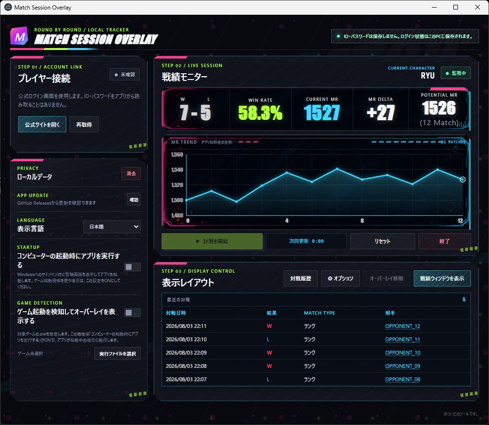
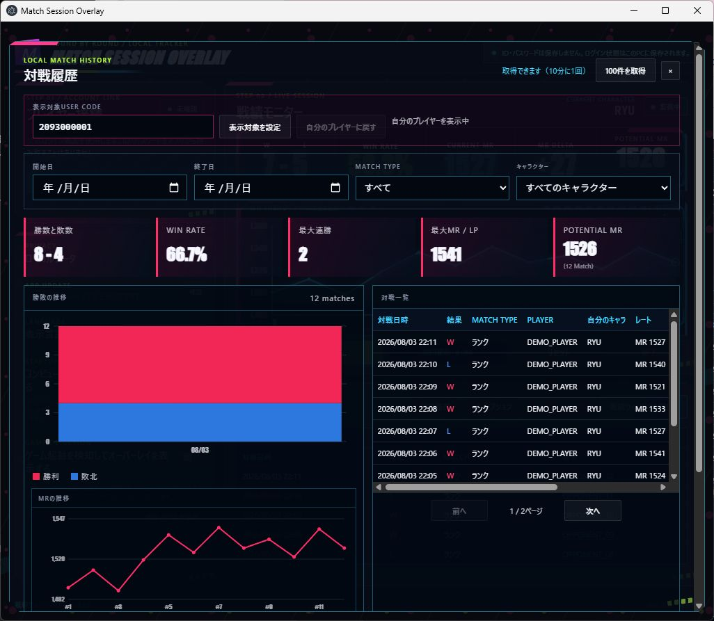

# Match Session Overlay

公開版: v1.0.11

## ダウンロード

[v1.0.11をダウンロード（GitHub Releases）](https://github.com/mickangumi-oss/match-session-overlay/releases/download/v1.0.11/Match-Session-Overlay-1.0.11-Setup.exe)

開いたページの「Assets」から、`Match-Session-Overlay-x.x.x-Setup.exe`をダウンロードして実行してください。最新版以外のファイルや、配布元を確認できないファイルは使用しないでください。

Match Session Overlayは、公式サイトから取得した対戦戦績を、ゲーム画面の横やゲーム画面の上に表示するWindows向けアプリです。ログイン中のプレイヤーだけでなく、ユーザーコード（USER CODE）を指定したプレイヤーの戦績も表示できます。OBSでの表示にも対応していますが、OBSを使わず通常のウィンドウだけで利用することもできます。

詳しい操作手順は[`docs/usage.md`](docs/usage.md)をご覧ください。ウィンドウの種類とグラフの動作は[`docs/window-layout.md`](docs/window-layout.md)、フォント設定は[`docs/font-settings.md`](docs/font-settings.md)で説明しています。

> [!IMPORTANT]
> 非公式のツールです。公式サイトの仕様変更などにより、予告なく戦績を取得できなくなる場合があります。

## 動作環境

- Windows 10以降（64ビット）
- 公式サイトへのログインと戦績取得に必要なインターネット接続
- OBSで表示する場合のみ、OBS Studio（任意）

OBSを使わない場合は、アプリの通常ウィンドウまたはオーバーレイだけで利用できます。

## 画面イメージ

画像はすべて説明用の仮データです。実在するプレイヤー名、USER CODE、ログイン情報、戦績は使用していません。






## はじめて使うとき

### 1. インストールする

上の「ダウンロード」から正式に公開されている`Match-Session-Overlay-x.x.x-Setup.exe`をダウンロードして実行します。配布元を確認できないファイルや、内容が変更された可能性のあるファイルは使用しないでください。

### 2. 公式サイトにログインする

1. アプリの「公式サイトを開く」を押します。
2. 表示された公式ログイン画面でログインします。
3. ログインが終わったら、ログイン画面のウィンドウを閉じます。

アプリがログイン中のプレイヤー情報を読み込みます。表示されないときは「再取得」を押してください。アプリにIDやパスワードを入力する必要はありません。

### 3. 計測を開始する

「計測を開始」を押すと、その時点を基準に勝敗、勝率、MRまたはLPの増減、グラフの記録を始めます。マスター到達済みのキャラクターはMR、未到達のキャラクターはLPを自動的に表示します。

### 4. 表示を選ぶ

「表示レイアウト」で、次の項目を選べます。

- **ランク／バトルハブ／カジュアル**: 表示する対戦モード
- **通常**: ゲーム画面の横などに置くウィンドウ
- **オーバーレイ**: ゲーム画面に重ねるコンパクトな表示
- **横／縦**: ウィンドウの向き
- **オーバーレイ移動／オーバーレイ固定**: オーバーレイの位置を動かすか固定するか

初回はオーバーレイを移動できる状態で起動します。位置とサイズを決めたら「オーバーレイ固定」を押してください。次回からは、保存した位置・サイズ・固定状態で起動します。

### 5. オプションを調整する

歯車マークの「オプション」から、次の設定を変更できます。

- **GRAPH**: グラフの表示・非表示
- **グラフ表示件数**: 最新20試合、50試合、100試合、または無制限
- **FONT SIZE**: 戦績の数字とラベルの文字サイズ
- **AXIS SIZE**: グラフ左側の目盛りの文字サイズ
- **BACKGROUND**: 背景の透明度（0%にすると背景を完全に透明化）
- **FONT／STYLE／COLOR**: フォント、通常・斜体、文字色
- **UPDATE INTERVAL**: 戦績を確認する間隔

### 6. 自動起動とゲーム起動検知を設定する（任意）

Windowsへのサインイン後にアプリを自動起動する場合は、「コンピューターの起動時にアプリを実行する」を有効にします。最小化した状態で起動し、通知領域（システムトレイ）から管理画面を開けます。

ゲームの起動に合わせてオーバーレイを表示する場合は、上の自動起動設定に加えて「ゲーム起動を検知してオーバーレイを表示する」も有効にし、対象ゲームの実行ファイル（`.exe`）を指定してください。アプリがバックグラウンドで動作し、指定した`.exe`の起動を検知したときにオーバーレイを表示します。

## 主な機能

- ランク、バトルハブ、カジュアルの戦績を切り替えて表示
- 勝敗、勝率、現在のMR／LP、計測開始後の増減を表示
- MR／LPの推移をグラフで表示（表示件数は20試合、50試合、100試合、無制限から選択）
- 同じキャラクターの直近のレートから、`POTENTIAL MR`または`POTENTIAL LP`を表示
- `POTENTIAL MR／POTENTIAL LP`は公式のレートではなく、直近の同キャラクターの値の中央値を使った実力の目安。2試合以上で表示し、整数は四捨五入
- 新しい対戦が30分ない場合は確認間隔を5分に延ばし、60分ない場合は自動停止
- 手動更新の連打を防ぐため、通信を直列化し、最短間隔と段階的な再試行を適用
- 対戦履歴の取得ボタンで、公式サイトから最新100件を取得してローカルに保存（取得は10分に1回まで）
- 保存した履歴を期間、対戦モード、キャラクターで絞り込み、勝敗数、勝率、最大連勝数、最大MR／LPなどを確認
- ログイン中のプレイヤーとは別のUSER CODEを指定して、そのプレイヤーの戦績や履歴を表示（読み取り専用）
- 対戦一覧の相手名から、相手のUSER CODEを設定して履歴を表示
- Windowsへのサインイン時の自動起動を任意で設定
- 管理画面を最小化または閉じても、戦績ウィンドウとOBS用オーバーレイの表示を維持（アプリを終了するとすべて終了）
- 14言語に対応（日本語、英語、ドイツ語、スペイン語（スペイン／米国）、フランス語、イタリア語、韓国語、中国語（簡体／繁体）、ポルトガル語（ブラジル）、ポーランド語、ロシア語、アラビア語）
- アプリからログインセッション、Cookie、キャッシュを削除
- アンインストール時にアプリ専用データを削除
- GitHub Releasesから更新情報とインストーラーを取得し、SHA-256を照合してから更新

## 通信について

サイトへの負荷を抑えるため、通信は次のように制御しています。

- 同時に複数の通信を行わず、1件ずつ処理
- 最短の確認間隔を設定し、短時間の連打を防止
- エラーが続いた場合は、再試行までの待ち時間を段階的に延長
- 1回の通信は30秒でタイムアウト
- サーバーから`429`や`Retry-After`が返った場合は、その指示に従って待機
- 一定時間対戦がない場合は確認間隔を延長し、さらに時間が経つと自動停止

## ログイン情報と保存先

このアプリは、IDやパスワードを読み取ったり保存したりしません。

次回起動時もログイン状態を引き継げるように、公式サイトが発行する**ログインセッション情報（Cookieなど）**をこのPCに保存します。これはパスワードではありません。ログインセッションは永久に有効なものではなく、次のような場合に再ログインが必要になります。

- 公式サイト側でセッションの有効期限が切れた
- 公式サイトからログアウトした
- すべての端末からログアウトした
- アプリの「ローカルデータ」を消去した
- アプリをアンインストールした
- 公式サイトの仕様変更やセキュリティ上の判断で無効になった

保存場所はこのPCのアプリ専用フォルダーです。

- 表示設定: `%LOCALAPPDATA%\\MatchSessionOverlay\\user-data\\display-settings.json`
- 対戦履歴: `%LOCALAPPDATA%\\MatchSessionOverlay\\user-data\\match-history\\<USER CODE>.json`
- ログインセッションと一時ファイル: `%LOCALAPPDATA%\\MatchSessionOverlay\\session-data\\`
- アプリの実行時データ: `%LOCALAPPDATA%\\MatchSessionOverlay\\`

`%LOCALAPPDATA%`は、Windowsがユーザーごとに用意するアプリ用フォルダーです。エクスプローラーのアドレスバーに`%LOCALAPPDATA%`と入力すると開けます。対戦履歴には公式サイトから取得した表示用データだけを保存し、IDやパスワードは保存しません。

配布ファイルやインストーラーに、利用者のログイン状態、USER CODE、プレイヤー名、戦績は含まれません。アプリの「ローカルデータ」欄にある「消去」を押すと、このPCに保存されたログインセッションと一時ファイルを削除できます。削除後は再ログインが必要です。

## 更新

アプリの起動時にGitHub Releasesの最新バージョンを確認します。新しいバージョンが見つかると、確認ボタンを押さなくても管理画面に「更新」ボタンが表示されます。

「更新」を押すとインストーラーを取得し、公開元が示すSHA-256と一致することを確認してから再起動します。照合に失敗したファイルは実行しません。セキュリティ上の必須更新が設定されている場合は「強制更新」と表示され、更新が完了するまで旧バージョンを利用できません。

## OBSで表示する

管理画面に表示されるURLを、OBSの「ブラウザ」ソースに設定します。

```text
http://127.0.0.1:37123/overlay
```

このURLは、このアプリを実行している同じPCからだけアクセスできます。ブラウザソースの幅と高さは、アプリで設定したオーバーレイのサイズに合わせてください。初期サイズは`320 x 92`です。アプリ側でサイズを変更したときは、OBSのブラウザソースを再読み込みすると反映されます。

## 利用条件

このソフトウェアは無料で利用できますが、PolyForm Strict License 1.0.0の条件が適用されます。個人・非商用目的で利用できます。改変、派生版の作成、再配布、ライセンスの譲渡は許可されていません。配布元を確認できない改変版や再配布ファイルは使用しないでください。詳しい条件は[`LICENSE`](LICENSE)を確認してください。
