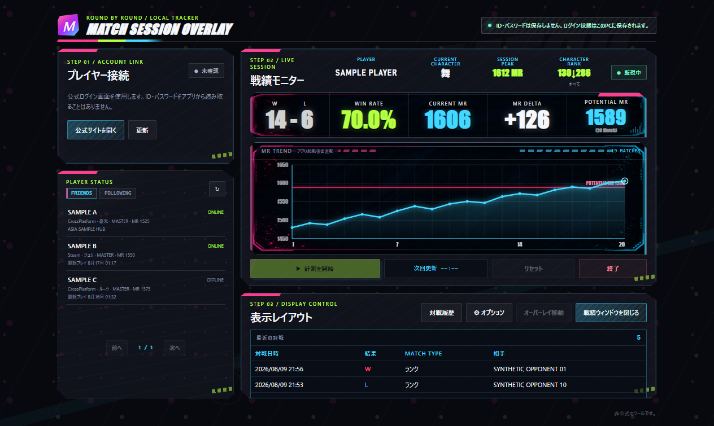
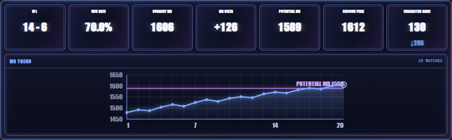
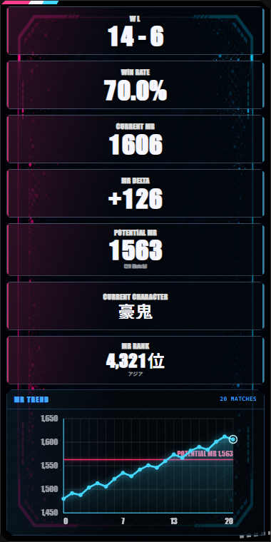
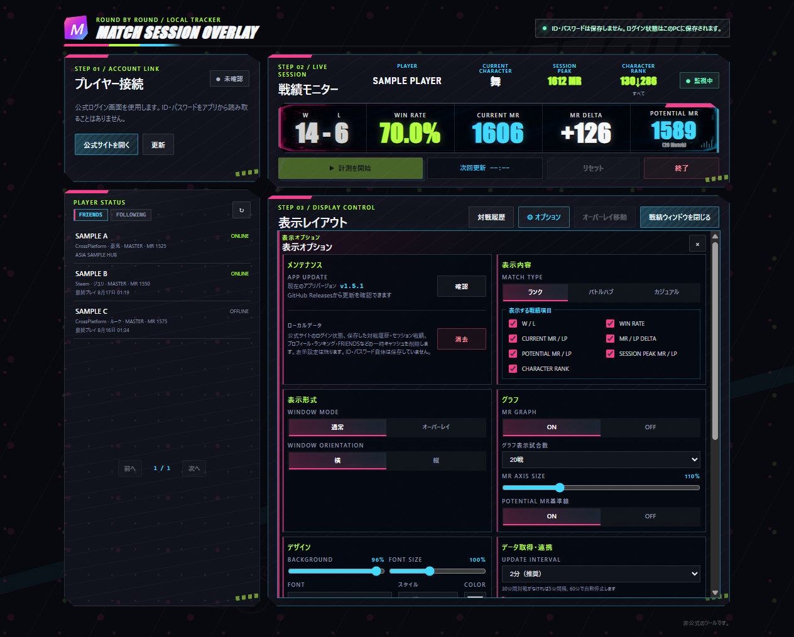
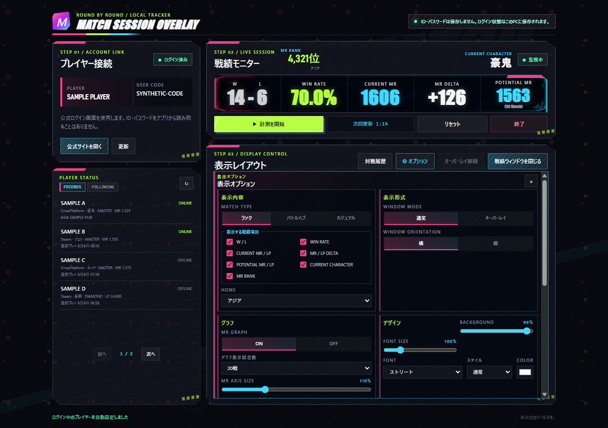

# Match Session Overlay

ストリートファイター6の対戦データを取得し、セッション中の勝敗、勝率、MR／LP、増減、現在のキャラクター、MASTERランキングなどを表示するWindows向けツールです。通常ウィンドウ、ゲーム上のオーバーレイ、OBSブラウザソースで利用できます。

> [!IMPORTANT]
> 非公式のツールです。公式サイトの仕様変更などにより、予告なく戦績を取得できなくなる場合があります。

## 動作環境

- Windows 10以降（64ビット）
- 公式サイトへのログインと戦績取得に必要なインターネット接続
- OBSで表示する場合のみ、OBS Studio（任意）

公開版: v1.1.0

## ダウンロード

[v1.1.0をダウンロード（GitHub Releases）](https://github.com/mickangumi-oss/match-session-overlay/releases/download/v1.1.0/Match-Session-Overlay-1.1.0-Setup.exe)

開いたページの「Assets」から、`Match-Session-Overlay-1.1.0-Setup.exe`をダウンロードして実行してください。最新版以外のファイルや、配布元を確認できないファイルは使用しないでください。

詳しい操作手順は[`docs/usage.md`](docs/usage.md)、表示レイアウトは[`docs/window-layout.md`](docs/window-layout.md)、対戦履歴は[`docs/match-history.md`](docs/match-history.md)、フォントは[`docs/font-settings.md`](docs/font-settings.md)をご覧ください。

## 画面イメージ

以下はすべて、実在しないプレイヤー名・USER CODE・戦績を使った合成データの画面です。

### 管理画面

MR RANKと現在のキャラクター、セッション戦績、FRIENDS／FOLLOWINGのプレイヤー状態をまとめて確認できます。



### 横表示ウィンドウ

選択した戦績カードを横に並べ、MR／LPグラフと一緒に表示できます。



### 縦表示オーバーレイ

横表示と同じ表示項目を縦に並べます。表示先や向きを変えても、選択した項目は共通です。



### オプション

表示内容、表示形式、グラフ、デザイン、データ取得・連携、アプリ設定、メンテナンスをカテゴリごとに設定できます。



### 対戦履歴

取得済みの対戦を絞り込み、勝敗、勝率、最大連勝、MR／LP推移、末尾7日間の勝敗グラフを確認できます。



## v1.1.0の変更内容

### 追加・改善

- 表示する戦績項目を、通常ウィンドウ、縦表示、横表示、オーバーレイ、OBSで共通化しました。
- `W／L`、`WIN RATE`、`CURRENT MR／LP`、`MR／LP DELTA`、`POTENTIAL MR／LP`、`CURRENT CHARACTER`、`MR RANK`、グラフを個別に選べるようにしました。
- 現在のキャラクターのMASTERランキング順位を追加し、HOMEを「すべて」、地域、国から選べるようにしました。
- 選択中の表示言語に対応した公式プロフィールのキャラクター名を表示するようにしました。
- 管理画面にFRIENDS／FOLLOWINGのプレイヤー状態を追加しました。
- 対戦履歴の勝敗グラフを、末尾7日間の実際の日付位置で表示するようにしました。
- 100件の対戦履歴取得中に、取得済みページから順次表示し、進捗を確認できるようにしました。
- アプリ設定とメンテナンス設定をオプションへまとめ、カテゴリを2列で整理しました。

### 不具合修正

- グラフだけを表示したとき、下部に不要な背景余白が残る問題を修正しました。
- 縦表示と横表示のグラフを、読めない大きさまで縮小できる問題を修正しました。
- 横表示で戦績カードとグラフが狭くなりすぎる問題を修正しました。
- 表示項目の変更が通常ウィンドウやオーバーレイ、OBSへすぐ反映されないことがある問題を修正しました。
- キャラクターや表示言語を切り替えたとき、別キャラクターや別言語の名前が混ざることがある問題を修正しました。

過去の変更内容は[`docs/release-notes`](docs/release-notes)をご覧ください。

## はじめて使うとき

### 1. インストールする

上の「ダウンロード」から正式なインストーラーをダウンロードし、画面の案内に従ってインストールします。

### 2. 公式サイトにログインする

1. アプリの「公式サイトを開く」を押します。
2. 表示された公式画面でログインします。
3. ログインが終わったら公式画面を閉じます。

ログイン中のプレイヤーが表示されない場合は「更新」を押してください。アプリがIDやパスワードを読み取ることはありません。

### 3. 計測を開始する

「計測を開始」を押すと、その時点を基準に勝敗、勝率、MR／LPの増減、グラフの記録を始めます。MASTER到達済みのキャラクターはMR、それ以外はLPを表示します。

### 4. 表示方法を選ぶ

「オプション」の「表示形式」で通常ウィンドウ／オーバーレイと横／縦を選び、「戦績ウィンドウを表示」を押します。オーバーレイは移動状態で位置とサイズを決めた後、「オーバーレイ固定」を押すとゲーム操作を優先できます。

OBSでは、管理画面に表示されるブラウザソースURLをOBSの「ブラウザ」ソースへ設定します。

## オプション

オプションは、画面のスクロール量を抑えるためカテゴリカードを2列で表示します。

### 表示内容

- 対戦モード: ランク／バトルハブ／カジュアル
- 表示する戦績項目: W／L、WIN RATE、CURRENT MR／LP、MR／LP DELTA、POTENTIAL MR／LP、CURRENT CHARACTER、MR RANK、グラフ
- HOME: MASTERランキングの「すべて」、地域、国

表示項目は通常ウィンドウ、オーバーレイ、OBSで共通です。変更はすぐに反映され、最低1項目は常に表示されます。管理画面の戦績モニターは確認用として全項目を表示し、この設定の影響を受けません。

### 表示形式

- WINDOW MODE: 通常／オーバーレイ
- WINDOW ORIENTATION: 横／縦

横表示ではカードを横に、縦表示では同じカードを縦に並べます。表示項目が少ない場合はカードを自動調整し、グラフをOFFにすると余白を詰めます。グラフだけを表示する場合も専用の最小サイズで可読性を保ちます。

### グラフ

- グラフ表示 ON／OFF
- グラフ表示試合数: 20／50／100／すべて
- MR／LP軸サイズ
- POTENTIAL MR／LP基準線

### デザイン

- 背景透過
- フォント、フォントサイズ
- 通常／斜体
- フォントカラー

### データ取得・連携

- 戦績取得間隔: 2分／3分／5分
- OBSブラウザソースURL

### アプリ設定・メンテナンス

- 表示言語
- Windowsサインイン時の自動起動
- ゲーム起動検知によるオーバーレイ表示
- ローカルデータの消去
- アプリ更新の確認

## 主な機能

- ランク、バトルハブ、カジュアルの戦績を切り替えて表示
- 勝敗、勝率、現在のMR／LP、計測開始後の増減を表示
- 同じキャラクターの直近20試合の中央値を、参考値の`POTENTIAL MR／POTENTIAL LP`として表示
- 現在のキャラクターのMASTERランキング順位をHOME条件付きで表示。非MASTERは`—`表示
- 表示言語に対応した公式プロフィールのキャラクター名を表示
- FRIENDS／FOLLOWINGをオンライン優先で表示し、プレイヤー名から対戦履歴へ移動
- 対戦履歴を最大100件取得し、期間、対戦モード、キャラクターで絞り込み
- 対戦履歴の取得中は、取得できたページから表示して進捗を案内
- 勝敗グラフは末尾7日間を固定幅で表示し、試合のない日は空白を維持
- 新しい対戦が30分ない場合は確認間隔を5分に延ばし、60分ない場合は自動停止
- Windowsサインイン時の自動起動と、ゲーム起動検知によるオーバーレイ表示
- 日本語、英語など14言語に対応
- アンインストール時にアプリ専用データを削除

## 通信について

公式サイトへの負荷を抑えるため、通信は1件ずつ行い、短時間の連打を防ぎます。通信エラーが続いた場合は再試行までの待ち時間を延長し、公式サイトから待機時間が指定された場合はその指示に従います。

FRIENDS／FOLLOWINGは管理画面を表示している間、設定した戦績取得間隔と同じ周期で自動更新します。管理画面を閉じて通知領域へ格納している間は更新を停止し、再表示時にすぐ更新します。

## ログイン状態と保存先

公式サイトのログイン状態、表示設定、対戦履歴は、このPCのアプリ専用フォルダーへ保存されます。IDやパスワードを保存することはありません。

- 表示設定: `%LOCALAPPDATA%\MatchSessionOverlay\user-data\display-settings.json`
- 対戦履歴: `%LOCALAPPDATA%\MatchSessionOverlay\user-data\match-history\<USER CODE>.json`
- ログイン状態と一時ファイル: `%LOCALAPPDATA%\MatchSessionOverlay\session-data\`

アプリの「メンテナンス」にある「ローカルデータ」の「消去」を押すと、このPCに保存されたログイン状態と一時ファイルを削除できます。削除後は再ログインが必要です。

## 更新

アプリの起動時にGitHub Releasesの最新版を確認します。新しいバージョンが見つかると、管理画面に更新案内が表示されます。

## OBSで表示する

管理画面に表示される次のURLを、OBSの「ブラウザ」ソースに設定します。

```text
http://127.0.0.1:37123/overlay
```

このURLは、アプリを実行している同じPCからだけアクセスできます。ブラウザソースの幅と高さは、アプリで設定したオーバーレイのサイズに合わせてください。表示項目やデザインの変更はOBSにも反映されます。

## 利用条件

このソフトウェアは無料で利用できますが、PolyForm Strict License 1.0.0の条件が適用されます。個人・非商用目的で利用できます。改変、派生版の作成、再配布、ライセンスの譲渡は許可されていません。詳しい条件は[`LICENSE`](LICENSE)を確認してください。
