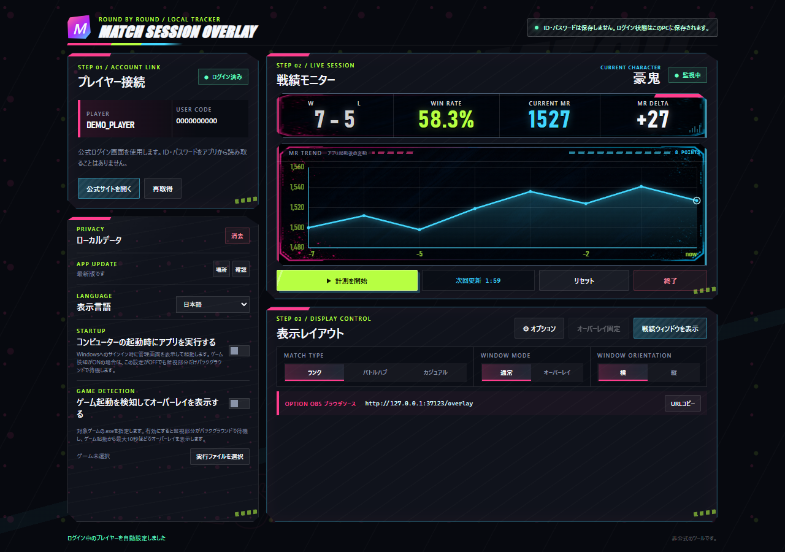
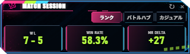
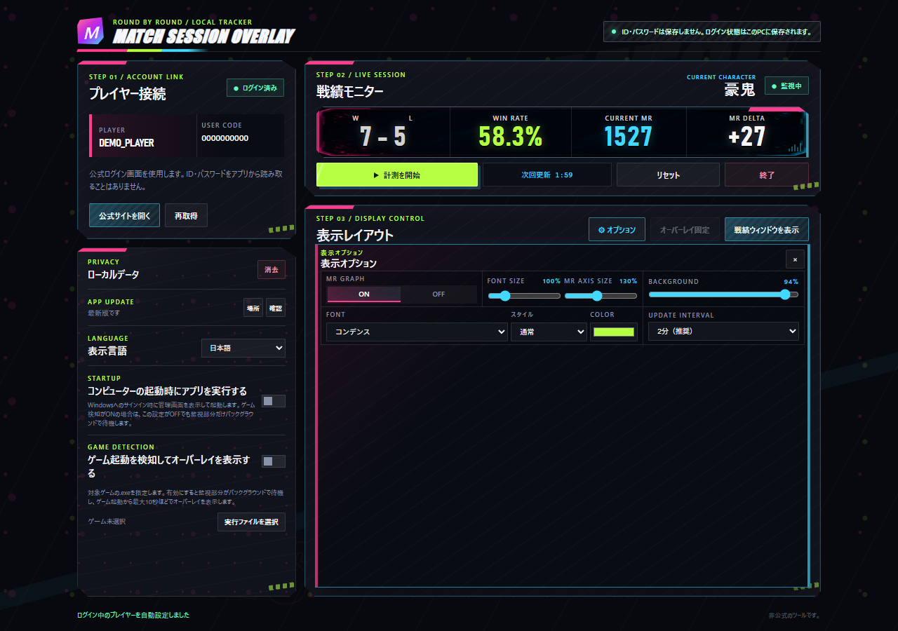

# はじめて使う方へ

このページでは、インストール直後の基本操作を説明します。

## 1. インストール

1. 管理者が案内する正式な配布元から `Match-Session-Overlay-x.x.x-Setup.exe` をダウンロードします。配布元が確認できないファイルは使用しないでください。
2. ダウンロードしたインストーラーを実行し、画面の指示に従います。
3. インストール後にアプリを起動します。

Windowsの警告が表示された場合は、入手元とファイル名を確認してください。配布元が不明な再配布ファイルは実行しないでください。

## 2. 公式サイトへログインする

アプリの「プレイヤー接続」で「公式サイトを開く」を押し、公式サイトのログイン画面でログインします。

アプリがIDやパスワードを読み取ることはありません。ログイン後にログインウィンドウを閉じると、ログイン中のプレイヤー情報がアプリへ反映されます。表示されない場合は「再取得」を押してください。ログイン状態は、このPCのアプリ専用フォルダーに保存されます。保存場所は `%LOCALAPPDATA%\MatchSessionOverlay\session-data\` です。



## 3. 計測を開始する

1. 「表示レイアウト」で対象の対戦種別を選びます。
   - ランク
   - バトルハブ
   - カジュアル
2. 「計測を開始」を押します。
3. アプリ起動後の勝敗数、勝率、MRまたはLPの増減が表示されます。

キャラクターごとに戦績を管理します。マスターランクのキャラクターはMR、それ以外のキャラクターはLPが表示されます。キャラクターを切り替えた場合は、切り替え後のキャラクターの記録に変わります。

## 4. ゲーム画面の横に表示する

「戦績ウィンドウを表示」を押すと、通常のウィンドウが開きます。ゲーム画面の横へ移動し、サイズを調整してください。

ゲーム画面上に重ねる場合は、次の手順で設定します。

1. `WINDOW MODE` の「オーバーレイ」を選びます。
2. 初回は「オーバーレイ移動」の状態で位置を調整します。
3. 位置が決まったら「オーバーレイ固定」を押します。
4. 固定中はクリックがゲームへ通過するため、ゲーム操作を妨げにくくなります。



グラフは管理画面の「戦績モニター」に表示されます。ランクマッチを2試合以上計測すると、MR/LPの推移を確認できます。横長のゲーム上オーバーレイやOBS用のコンパクト表示にはグラフを表示しません。

### ゲーム起動時に自動表示する（任意）

ゲームの起動を検知してオーバーレイを自動表示する場合は、次の2つを有効にしてください。

1. 「コンピューターの起動時にアプリを実行する」
2. 「ゲーム起動を検知してオーバーレイを表示する」

2つ目では、対象ゲームの`.exe`ファイルを指定します。検知は、Windowsへのサインイン後にアプリがバックグラウンドで起動している場合に行われます。Windows起動時のアプリ実行がOFFの場合、ゲーム起動検知も自動的にOFFになります。

## 5. 表示を好みに合わせる

歯車の「オプション」から、使用頻度の低い表示設定を変更できます。

- `GRAPH`: MR/LPグラフの表示・非表示
- `FONT SIZE`: 戦績数値の大きさ
- `AXIS SIZE`: グラフ左側のMR/LP目盛りの大きさ
- `BACKGROUND`: 背景の透過度（0%で完全透過）
- `FONT`: Windowsにインストールされているフォント
- `STYLE`: 通常／斜体
- `COLOR`: 数値の色
- `UPDATE INTERVAL`: 通常の取得間隔（最短2分）

フォントの詳しい説明は [フォント設定](font-settings.md) を参照してください。



## 6. OBSで表示する（任意）

OBSを使う場合は、アプリを起動した状態でブラウザソースを追加し、次のURLを指定します。

```text
http://127.0.0.1:37123/overlay
```

ブラウザソースの幅・高さは、アプリ側のオーバーレイサイズに合わせて設定してください。OBSを使わず、通常のウィンドウやゲーム上のオーバーレイだけで使用することもできます。

## 7. 計測を終える・データを消す

- 「リセット」: 現在のセッションの勝敗数と増減を0から数え直します。
- 「終了」: 計測を停止します。表示中のウィンドウは「戦績ウィンドウを表示」から閉じます。
- 「ローカルデータ」の「消去」: このPCのログインセッション、Cookie、キャッシュを削除します。表示設定は残ります。

サイトへの負荷を抑えるため、取得間隔には安全な下限があります。新しい対戦が30分ない場合は5分間隔に伸び、60分更新がない場合は自動停止します。

## 困ったときは

### プレイヤー情報が表示されない

公式サイトでログインできているか確認し、アプリの「再取得」を押してください。ログイン状態が切れている場合は、もう一度「公式サイトを開く」からログインします。

### MR/LPが `---` と表示される

計測開始直後は基準値を取得中の場合があります。次回更新まで待ってください。表示が続く場合は一度「終了」を押してから、もう一度「計測を開始」を押します。キャラクターがマスター未到達の場合はLP表示になります。

### オーバーレイを動かせない

「オーバーレイ移動」に切り替えてから位置を調整してください。固定中はゲーム操作を優先するため、オーバーレイをクリックしても動きません。

### 更新を確認したい

アプリ起動時にGitHub Releasesを自動確認します。新しい版が見つかると管理画面に「更新」ボタンが表示されます。「確認」を押して手動確認することもできます。更新元のフォルダーを指定する機能はありません。

## 個人情報について

- ログインセッション、Cookie、キャッシュは `%LOCALAPPDATA%\MatchSessionOverlay\session-data\` に保存されます。
- 表示設定は `%LOCALAPPDATA%\MatchSessionOverlay\user-data\` に保存されます。
- ユーザーコード、プレイヤー名、戦績はアプリ設定ファイルへ保存せず、アプリの実行中にだけ使用します。
- これらは配布ファイルではなく、このPCのアプリ専用フォルダーに保存されます。
- `%LOCALAPPDATA%` は、Windowsがユーザーごとに用意するアプリ用フォルダーを表す名前です。実際の場所を確認するには、エクスプローラーのアドレスバーに `%LOCALAPPDATA%\MatchSessionOverlay\` と入力します。
- 「ローカルデータ」の「消去」では、ログインセッション、Cookie、キャッシュを削除できます。表示設定は残ります。

## 利用条件

このソフトウェアは無料で利用できますが、PolyForm Strict License 1.0.0の条件が適用されます。個人・非商用目的で利用できますが、ソフトウェアの改変、派生版の作成、再配布、ライセンスの譲渡は許可されていません。詳しい条件は、アプリと一緒に配布される`LICENSE`を確認してください。
